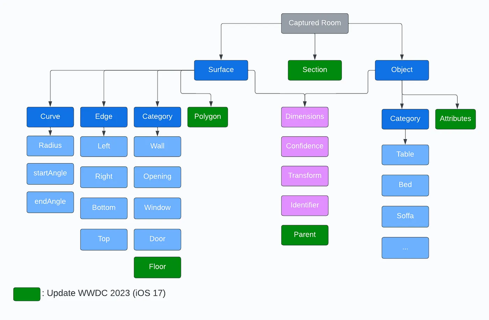
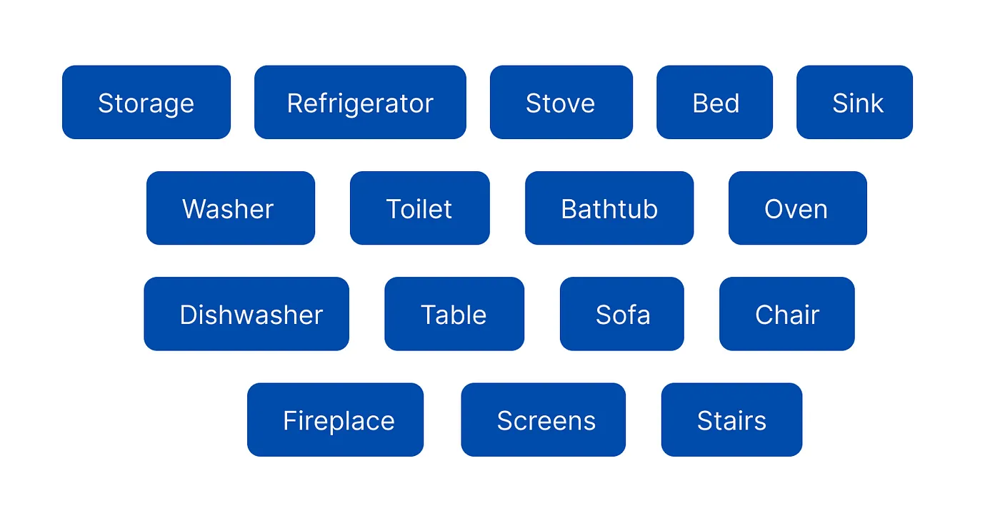

# 🏠 flutter_roomplan

**Seamlessly integrate Apple's RoomPlan SDK into your Flutter apps**  
Capture accurate 3D room scans using ARKit with this powerful plugin. Perfect for AR measurement, smart home, and interior design solutions.

---

## ⚠️ Requirements

- **iOS 16.0+** (for single room scanning)
- **iOS 17.0+** (for multi-room merge support)
- **ARKit-compatible device**:  
  iPhone 12 or later, or recent iPad Pro
- **LiDAR Scanner** **required** for room scanning functionality

---

## 📌 Key Features

- 📸 Launches native `RoomCaptureViewController` for full-screen AR scanning
- 🪄 Captures room geometry + objects as structured JSON
- 🔗 Simple Flutter API to start scans and handle results
- 🚀 Returns complete `CapturedRoom` JSON specification
- 📱 Device compatibility checking
- 📦 USDZ file export support
- 📜 **JSON file export support** for room data and metadata
- 🏘️ **Multi-room merge support** (iOS 17.0+) for scanning and combining multiple rooms

---

## 🔍 Data Structure

The following diagram shows the structure of the captured room data:



> The green nodes indicate updates from WWDC 2023 (iOS 17)

---

## 🚀 Quick Start

### 1️⃣ Installation

Add to `pubspec.yaml`:

```yaml
dependencies:
  flutter_roomplan: latest_version
```

### 2️⃣ Basic Usage

```dart
import 'package:flutter_roomplan/flutter_roomplan.dart';

// Create plugin instance
final roomPlan = FlutterRoomplan();

// Check if device supports RoomPlan
final isSupported = await roomPlan.isSupported();
final isMultiRoomSupported = await roomPlan.isMultiRoomSupported();

// Register callback for scan results
roomPlan.onRoomCaptureFinished(() async {
  print('Room scan completed');
  // Get file paths after scan
  final usdzPath = await roomPlan.getUsdzFilePath();
  final jsonPath = await roomPlan.getJsonFilePath();
  print('USDZ: $usdzPath');
  print('JSON: $jsonPath');
});

// Start single room scanning
try {
  await roomPlan.startScan();
} catch (e) {
  print('Error starting scan: $e');
}

// Start multi-room scanning (iOS 17.0+)
try {
  await roomPlan.startScan(enableMultiRoom: true);
} catch (e) {
  print('Error starting multi-room scan: $e');
}
```

### 3️⃣ Available Methods

- `isSupported()`: Check if the device supports RoomPlan (iOS 16.0+)
- `isMultiRoomSupported()`: Check if the device supports multi-room merge (iOS 17.0+)
- `startScan()`: Launch single room scanning interface
- `startScan(enableMultiRoom: true)`: Launch multi-room merge scanning (iOS 17.0+)
- `onRoomCaptureFinished()`: Register callback for scan results
- `getUsdzFilePath()`: Get path to exported USDZ file from last scan
- `getJsonFilePath()`: Get path to exported JSON file from last scan

### 4️⃣ Error Handling

The plugin throws exceptions for common errors:

- Device not supported
- Required permissions not granted
- Scan initialization failures

Always wrap `startScan()` in a try-catch block and check device support before scanning.

---

## 📝 Example

Check out the [example app](example/lib/main.dart) for a complete implementation showing:

- Device support checking
- Multi-room support detection
- Single room scanning
- Multi-room merge scanning (iOS 17.0+)
- Result handling
- USDZ file path retrieval
- JSON file path retrieval
- Error management

---

## ⚠️ Limitations

### Multiple Rooms Scanning

- **Multi-room merge support** available on iOS 17.0+ devices
- Single room scanning supported on iOS 16.0+
- Can produce inaccurate data during extended scanning sessions
- Device may experience overheating on longer scans
- Best practice: For iOS 16 devices, scan one room at a time with cooling breaks between scans

### Surface Shape Detection

- Limited to rectangular and square surface detection
- Cannot accurately detect curved edges or irregular shapes
- Assumes all surfaces are planar with right angles

### Phantom Object Detection

- May occasionally detect non-existent objects
- Can produce false positives in complex lighting conditions
- Recommend verifying critical measurements manually

### Object Detection Limits

- Currently restricted to 16 types of household objects
- Limited to common furniture and fixture categories
- May not recognize specialized or custom furniture pieces



---

## 📄 License

This project is licensed under the MIT License - see the LICENSE file for details.
